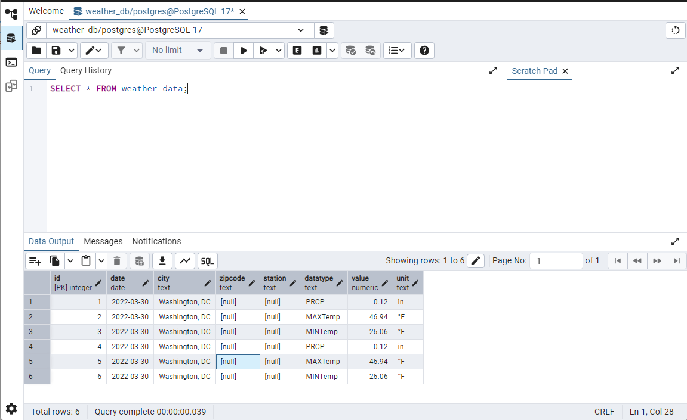

Requirements:
    - Postman: https://www.postman.com
    - An API key from NOAA. You can get request your own from them use this one: IggRHzbDhtnNuoonGlvZvttvXesSjclJ

Procedure:

In Postman, click the '+' button to create a new tab

In the new tab, set GET as your request type:

Next, in the URL field, start with the root URL for the NOAA API:
    - https://www.ncdc.noaa.gov/cdo-web/api/v2/data

From there, build the request. First, click on the headers tab under the URL field:
    - Add a field and add "token" to the key column
    - In the Value column, add your API key or the key I included above.

Next, fill out your parameters. There are more parameters available but here are a few example ones:

datasetid: this parameter requires an id code from one of the available datasets
All datasets can be fetched by performing a GET request on this URL:
https://www.ncei.noaa.gov/cdo-web/api/v2/datasets
GHCND provides daily summary data

datatypeid: this parameter also requires the code for the data you want
All the categories are availableh here:
https://www.ncei.noaa.gov/cdo-web/api/v2/datacategories?limit=41

PRCP is the daily precipitation

stationId: this will be the ID for a specific station. Can be swapped for locationId to get data about specific locations rather than specific weather stations.
USC00356750 is the data from the station at the Portland Airport.

startdate and enddate: dates in the YYYY-MM-DD format to specify the start
and end of when it will return the data from. Data does take some time to get into their system, you are not always guaranteed to get as much data as you request.

limit: the maximum number of results that you will get, generally will give a url in there for the next page of results.

units: I chose metric, but can be swapped for imperial

Once you've added all parameters and arguments, your request should look like this:

https://www.ncdc.noaa.gov/cdo-web/api/v2/data?datasetid=GHCND&datatypeid=PRCP&stationid=GHCND:USC00356750&startdate=2025-02-10&enddate=2025-02-18&limit=3&units=metric