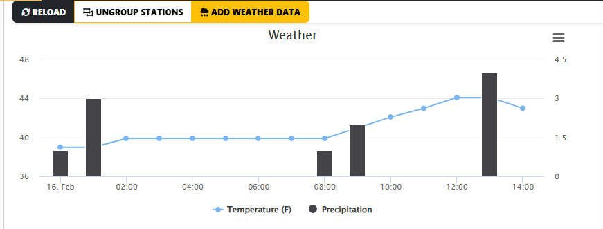
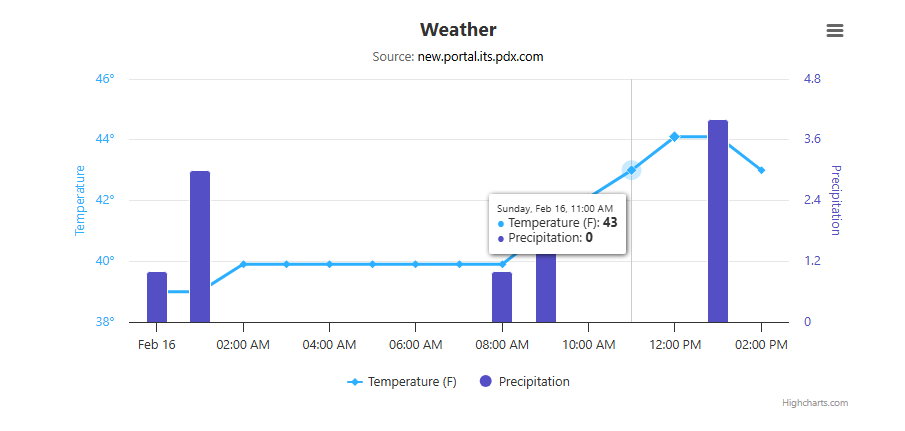

# CS469-weather
Practicing creating data displays for weather APIs

This is the reference photo I used from one of the websites Tammy showed us
where she said she wanted the graph to look like

This is what I have so far in the combination of html,javascript, and css

