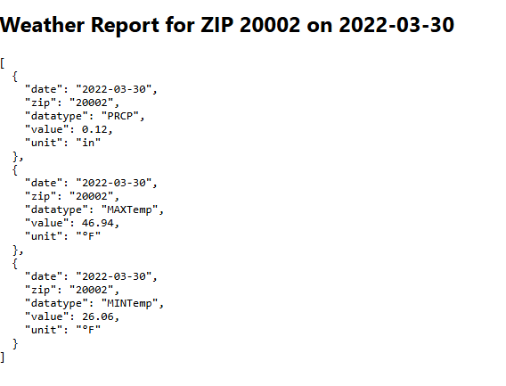

For this to work you have to make a local sql server, I did this using PgAdmin4, 
After making the server, I used this schema 

CREATE TABLE weather_data (
  id SERIAL PRIMARY KEY,
  date DATE NOT NULL,
  city TEXT,
  zipcode TEXT,
  station TEXT,
  datatype TEXT,
  value NUMERIC,
  unit TEXT
);

than when in the directory of my_weather_app
I ran "npm run start" which will start the frontend showing something like this 

Than it will send the data to the database and it should look like this

